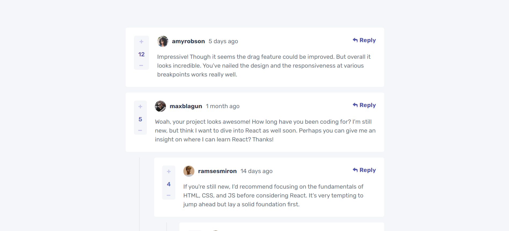

# Frontend Mentor - Interactive comments section solution

This is a solution to the [Interactive comments section challenge on Frontend Mentor](https://www.frontendmentor.io/challenges/interactive-comments-section-iG1RugEG9). Frontend Mentor challenges help you improve your coding skills by building realistic projects.

## Table of contents

- [Overview](#overview)
  - [The challenge](#the-challenge)
  - [Screenshot](#screenshot)
  - [Links](#links)
- [My process](#my-process)
  - [Built with](#built-with)
  - [What I learned](#what-i-learned)
- [Author](#author)

## Overview

### The challenge

Users should be able to:

- View the optimal layout for the app depending on their device's screen size
- See hover states for all interactive elements on the page
- Create, Read, Update, and Delete comments and replies
- Upvote and downvote comments
- Use `localStorage` to save the current state in the browser that persists when the browser is refreshed.
- Instead of using the `createdAt` strings from the `data.json` file, try using timestamps and dynamically track the time since the comment or reply was posted - the new time renders on page reload.

### Screenshot



### Links

- Solution URL: [https://interactive-comments-section-reactjs.netlify.app/](https://interactive-comments-section-reactjs.netlify.app/)

## My process

### Built with

- Semantic HTML5 markup
- Flexbox
- CSS Grid
- Mobile-first workflow
- [React](https://reactjs.org/) - JS library
- [Styled Components](https://styled-components.com/) - For styles

### What I learned

Leraned how to write a recursive code.

```js
export function addComment(commentList, targetKey, newReply) {
  return commentList.map((comment) => {
    if (comment.key === targetKey) {
      return {
        ...comment,
        replies: [...comment.replies, newReply],
      };
    } else if (comment.replies?.length > 0) {
      return {
        ...comment,
        replies: addComment(comment.replies, targetKey, newReply),
      };
    } else {
      return comment;
    }
  });
}
```

## Author

- Frontend Mentor - [@MarnyMarina](https://www.frontendmentor.io/profile/MarnyMarina)
